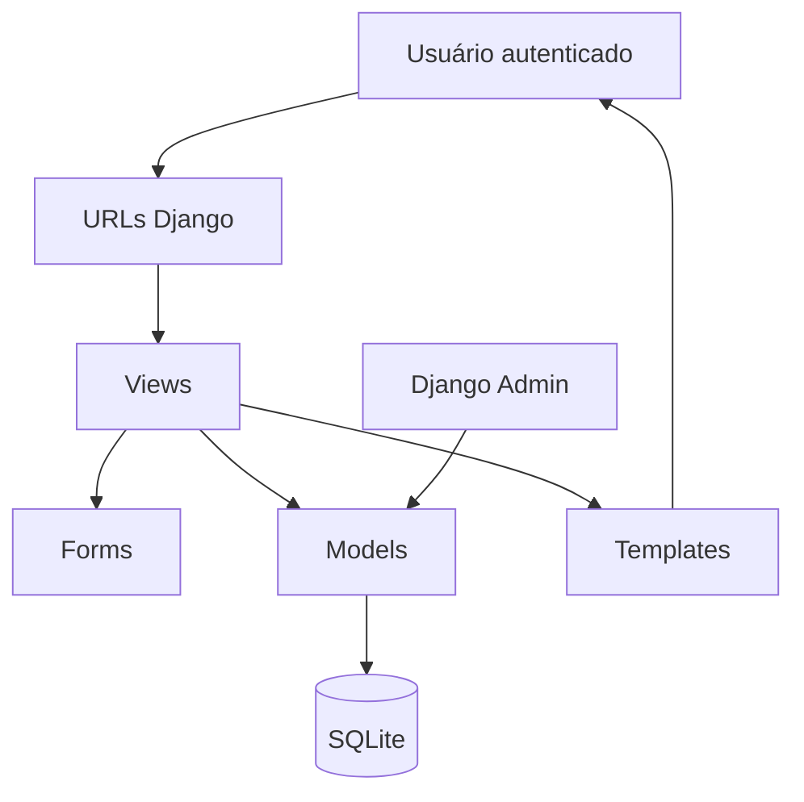
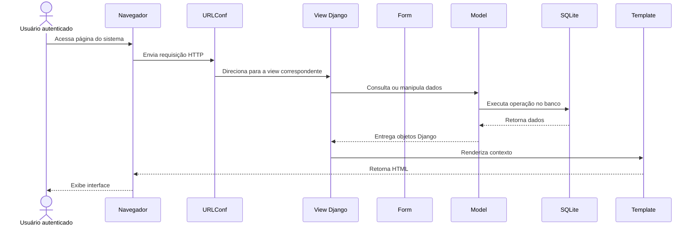
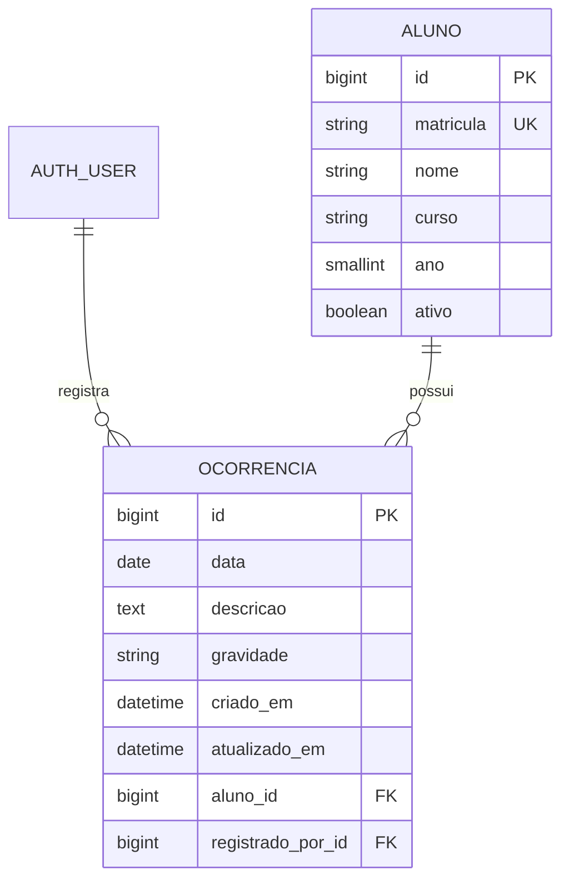

# 📘 Ocorrências AFS

**Ocorrências AFS** é um sistema web desenvolvido em Django para registrar, consultar e gerenciar ocorrências escolares relacionados a alunos.

O projeto oferece uma interface administrativa e operacional para acompanhamento de registros disciplinares, histórico por aluno, filtros por turma, curso, ano e gravidade, além de autenticação para acesso restrito.

---

## 🎯 Visão Geral

O objetivo principal do sistema é centralizar o controle de ocorrências escolares, permitindo que a gestão escolar registre eventos, acompanhe indicadores e consulte o histórico disciplinar dos alunos de forma organizada.

O sistema resolve problemas comuns em registros manuais ou descentralizados, como:

- Dificuldade de localizar ocorrências antigas.
- Falta de histórico consolidado por aluno.
- Ausência de indicadores por gravidade ou curso.
- Baixa rastreabilidade sobre quem registrou cada ocorrência.
- Necessidade de acesso restrito para dados escolares sensíveis.

O público-alvo inclui:

- Coordenação pedagógica.
- Direção escolar.
- Secretaria escolar.
- Profissionais autorizados a registrar e acompanhar ocorrências.

---

## ✅ Funcionalidades

### Autenticação

- Login obrigatório para acesso às telas principais.
- Logout via formulário `POST`.
- Redirecionamento automático para a tela de login quando o usuário não está autenticado.
- Uso do sistema nativo de autenticação do Django.

### Dashboard

- Exibição do total de ocorrências registradas.
- Contagem de ocorrências por gravidade:
  - Leves.
  - Médias.
  - Graves.
- Exibição do total de alunos ativos.
- Listagem das 5 ocorrências mais recentes.
- Distribuição de ocorrências por curso.
- Atalhos para cadastro de nova ocorrência e consulta de alunos.

### Gestão de Alunos

- Cadastro de alunos.
- Edição de dados de alunos.
- Listagem paginada de alunos ativos.
- Filtros por:
  - Nome.
  - Curso.
  - Ano.
- Consulta detalhada do aluno.
- Visualização do histórico de ocorrências por aluno.
- Indicadores por aluno:
  - Total de ocorrências.
  - Ocorrências leves.
  - Ocorrências médias.
  - Ocorrências graves.
- Atalho para registrar uma ocorrência vinculada ao aluno.

### Gestão de Ocorrências

- Cadastro de ocorrências.
- Edição de ocorrências.
- Exclusão de ocorrências com tela de confirmação.
- Listagem paginada de ocorrências.
- Consulta detalhada de ocorrência.
- Filtros por:
  - Nome do aluno.
  - Curso.
  - Ano.
  - Gravidade.
- Exibição do responsável pelo registro.
- Registro automático do usuário autenticado que criou a ocorrência.
- Exibição de data de criação e atualização do registro.

### Interface

- Layout responsivo baseado em Bootstrap.
- Design visual customizado com identidade AFS.
- Componentes de UI para:
  - Cards de métricas.
  - Tabelas responsivas.
  - Badges de gravidade.
  - Paginação.
  - Breadcrumbs.
  - Alertas de sucesso e erro.
- Customização visual do Django Admin.

### Administração

- Cadastro e manutenção de alunos via Django Admin.
- Cadastro e manutenção de ocorrências via Django Admin.
- Filtros administrativos por curso, ano, status e gravidade.
- Campos de busca por matrícula, nome do aluno e descrição.
- Preenchimento automático de `registrado_por` no admin ao criar nova ocorrência.
- Campos de metadados somente leitura:
  - Responsável pelo registro.
  - Data de criação.
  - Data de atualização.

---

## 🧰 Tecnologias Utilizadas

### Linguagens

- Python
- HTML
- CSS

### Frameworks

- Django 6.0.5
- Bootstrap 5.3.0

### Bibliotecas

- Bootstrap Icons 1.10.5
- Inter Font, via Google Fonts
- `asgiref`
- `sqlparse`
- `tzdata`

### Banco de Dados

- SQLite, configurado como banco padrão de desenvolvimento.

### Ferramentas

- Django ORM
- Django Templates
- Django Admin
- Django Authentication
- Django Forms
- Django Pagination
- Git
- GitHub

---

## 🏗️ Arquitetura do Projeto

O projeto segue o padrão arquitetural **MVT**, utilizado pelo Django:

- **Model**: define os dados e relacionamentos.
- **View**: processa requisições, aplica regras de consulta e renderiza respostas.
- **Template**: apresenta os dados em HTML.
- **Form**: valida e estrutura dados de entrada.
- **URLConf**: mapeia URLs para views.



### Estrutura de Pastas

```text
ocorrencias_escolares/
├── .env.example
├── .gitignore
├── README.md
├── requirements.txt
├── ocorrencias_project/
│   ├── manage.py
│   ├── requirements.txt
│   ├── db.sqlite3
│   ├── DESIGN_SYSTEM_AFS.md
│   ├── ocorrencias_project/
│   │   ├── __init__.py
│   │   ├── settings.py
│   │   ├── urls.py
│   │   ├── asgi.py
│   │   └── wsgi.py
│   └── ocorrencias/
│       ├── __init__.py
│       ├── admin.py
│       ├── apps.py
│       ├── forms.py
│       ├── models.py
│       ├── tests.py
│       ├── urls.py
│       ├── views.py
│       ├── migrations/
│       │   ├── __init__.py
│       │   └── 0001_initial.py
│       ├── static/
│       │   └── ocorrencias/
│       │       └── css/
│       │           ├── admin.css
│       │           └── app.css
│       └── templates/
│           ├── admin/
│           │   └── base_site.html
│           ├── registration/
│           │   └── login.html
│           └── ocorrencias/
│               ├── base.html
│               ├── dashboard.html
│               ├── listar.html
│               ├── cadastrar.html
│               ├── detalhe.html
│               ├── editar.html
│               ├── excluir.html
│               ├── listar_alunos.html
│               ├── cadastrar_aluno.html
│               ├── detalhe_aluno.html
│               ├── editar_aluno.html
│               └── partials/
│                   ├── gravidade_badge.html
│                   └── paginacao.html
```

### Módulos Principais

#### `settings.py`

Arquivo principal de configuração do Django. Define:

- Carregamento de variáveis de ambiente com `load_dotenv`.
- `SECRET_KEY` via variável de ambiente.
- `DEBUG` via variável de ambiente.
- `ALLOWED_HOSTS` via variável de ambiente.
- Apps instalados.
- Middleware.
- Banco SQLite.
- Idioma `pt-br`.
- Fuso horário `America/Fortaleza`.
- Configurações de login e logout.

#### `models.py`

Define os modelos centrais do domínio:

- `Aluno`
- `Ocorrencia`

Esses modelos representam os alunos cadastrados e os registros de ocorrências escolares.

#### `forms.py`

Define formulários baseados em `ModelForm`:

- `AlunoForm`
- `OcorrenciaForm`

Esses formulários cuidam da renderização dos campos e validações específicas, como matrícula e nome não vazios.

#### `views.py`

Contém as views responsáveis por:

- Dashboard.
- Listagem, cadastro, edição, detalhe e exclusão de ocorrências.
- Listagem, cadastro, edição e detalhe de alunos.
- Filtros.
- Paginação.
- Mensagens de sucesso.

Todas as views principais usam `@login_required`.

#### `urls.py`

Mapeia as rotas do app `ocorrencias`:

- Dashboard.
- CRUD de ocorrências.
- Gestão de alunos.

O arquivo principal `ocorrencias_project/urls.py` inclui:

- Django Admin.
- URLs de autenticação do Django.
- URLs do app de ocorrências.

#### `templates/`

Contém a camada de apresentação HTML. Os templates usam herança a partir de `base.html` e componentes reutilizáveis em `partials`.

#### `static/`

Contém os arquivos CSS customizados:

- `app.css`: interface principal.
- `admin.css`: customização do Django Admin.

#### `admin.py`

Configura a administração dos modelos `Aluno` e `Ocorrencia` no Django Admin.

---

## ⚙️ Instalação

### Pré-requisitos

- Python compatível com Django 6.
- Git.
- Pip.
- Ambiente virtual Python.

### Clonar o Repositório

```bash
git clone https://github.com/ruan-codes/ocorrencias_escolares.git
cd ocorrencias_escolares
```

### Criar Ambiente Virtual

No Windows:

```bash
python -m venv venv
venv\Scripts\activate
```

No Linux ou macOS:

```bash
python3 -m venv venv
source venv/bin/activate
```

### Instalar Dependências

```bash
pip install -r requirements.txt
```

Caso ocorra erro relacionado ao módulo `dotenv`, instale também:

```bash
pip install python-dotenv
```

Recomenda-se adicionar essa dependência ao `requirements.txt`:

```text
python-dotenv
```

### Configurar Variáveis de Ambiente

Copie o arquivo de exemplo:

No Windows:

```bash
copy .env.example .env
```

No Linux ou macOS:

```bash
cp .env.example .env
```

Edite o arquivo `.env` com os valores do ambiente local.

Exemplo:

```env
SECRET_KEY=troque-por-uma-chave-secreta-forte
DEBUG=True
ALLOWED_HOSTS=127.0.0.1,localhost
```

### Configurar Banco de Dados

O projeto está configurado para usar SQLite:

```python
DATABASES = {
    "default": {
        "ENGINE": "django.db.backends.sqlite3",
        "NAME": BASE_DIR / "db.sqlite3",
    }
}
```

### Executar Migrações

Entre na pasta do projeto Django:

```bash
cd ocorrencias_project
```

Execute:

```bash
python manage.py migrate
```

### Criar Superusuário

```bash
python manage.py createsuperuser
```

Esse usuário será usado para acessar o Django Admin e também pode acessar o sistema web.

### Executar o Projeto

```bash
python manage.py runserver
```

Acesse:

```text
http://127.0.0.1:8000/
```

Admin:

```text
http://127.0.0.1:8000/admin/
```

Login:

```text
http://127.0.0.1:8000/accounts/login/
```

---

## 🔐 Configuração

### Variáveis de Ambiente

O projeto utiliza variáveis de ambiente carregadas pelo arquivo `.env`.

| Variável | Obrigatória | Descrição | Exemplo |
|---|---:|---|---|
| `SECRET_KEY` | Sim | Chave secreta usada pelo Django | `django-insecure-altere-este-valor` |
| `DEBUG` | Não | Ativa ou desativa modo debug | `True` |
| `ALLOWED_HOSTS` | Sim em produção | Lista de hosts permitidos | `localhost,127.0.0.1` |

### Arquivo `.env.example`

O arquivo `.env.example` serve como modelo para configuração local:

```env
SECRET_KEY=troque-por-uma-chave-secreta-forte
DEBUG=True
ALLOWED_HOSTS=127.0.0.1,localhost
```

### Boas Práticas de Segurança

- Nunca versionar o arquivo `.env`.
- Usar uma `SECRET_KEY` forte e exclusiva por ambiente.
- Definir `DEBUG=False` em produção.
- Configurar `ALLOWED_HOSTS` corretamente em produção.
- Usar HTTPS em ambiente público.
- Proteger o banco de dados contra acesso direto.
- Criar usuários administrativos individuais, evitando compartilhamento de credenciais.
- Revisar permissões de usuários no Django Admin.
- Remover arquivos gerados e banco local do versionamento quando aplicável, como:
  - `db.sqlite3`
  - `__pycache__/`
  - `*.pyc`

---

## 🔄 Fluxo de Funcionamento

### Fluxo Geral



### Fluxo de Autenticação

1. Usuário acessa uma rota protegida.
2. O decorator `@login_required` verifica a sessão.
3. Se não houver autenticação, o usuário é redirecionado para `/accounts/login/`.
4. O login usa as views nativas de autenticação do Django.
5. Após autenticação, o usuário é redirecionado para `/`.

### Fluxo do Dashboard

1. A rota `/` aciona a view `dashboard`.
2. A view agrega dados da tabela `Ocorrencia`.
3. São calculados:
   - Total de ocorrências.
   - Total por gravidade.
   - Ocorrências por curso.
   - Total de alunos ativos.
   - Ocorrências recentes.
4. O template `dashboard.html` renderiza métricas, tabela e gráfico visual por barras.

### Fluxo de Cadastro de Aluno

1. Usuário acessa `/alunos/novo/`.
2. A view `cadastrar_aluno` instancia `AlunoForm`.
3. Em requisição `POST`, o formulário valida:
   - Matrícula obrigatória.
   - Nome obrigatório.
   - Curso válido.
   - Ano válido.
4. Se válido, o aluno é salvo.
5. O usuário é redirecionado para a listagem de alunos.

### Fluxo de Cadastro de Ocorrência

1. Usuário acessa `/cadastrar/`.
2. A view `cadastrar` instancia `OcorrenciaForm`.
3. O campo `aluno` lista apenas alunos ativos.
4. Em requisição `POST`, o formulário valida os dados.
5. A view preenche `registrado_por` com `request.user`.
6. A ocorrência é salva no banco.
7. O usuário é redirecionado para a listagem de ocorrências.

### Fluxo de Consulta de Aluno

1. Usuário acessa `/alunos/<id>/`.
2. A view `detalhe_aluno` busca o aluno.
3. O sistema consulta ocorrências relacionadas usando `related_name="ocorrencias"`.
4. Calcula estatísticas por gravidade.
5. Pagina o histórico em grupos de 10 ocorrências.
6. Renderiza `detalhe_aluno.html`.

### Fluxo de Consulta de Ocorrência

1. Usuário acessa `/detalhe/<id>/`.
2. A view `detalhe` busca a ocorrência com aluno e usuário responsável.
3. O template exibe:
   - Dados do aluno.
   - Data da ocorrência.
   - Gravidade.
   - Descrição.
   - Responsável pelo registro.
   - Data de criação.
   - Data de atualização, quando aplicável.

---

## 🗃️ Modelagem de Dados



### Modelo `Aluno`

Representa um estudante cadastrado no sistema.

| Campo | Tipo | Obrigatório | Descrição |
|---|---|---:|---|
| `id` | `BigAutoField` | Sim | Identificador primário automático. |
| `matricula` | `CharField(max_length=20)` | Sim | Matrícula única do aluno. Possui índice e restrição `unique=True`. |
| `nome` | `CharField(max_length=200)` | Sim | Nome completo do aluno. Possui índice. |
| `curso` | `CharField(max_length=50)` | Sim | Curso do aluno, limitado às opções definidas em `Aluno.Curso`. Possui índice. |
| `ano` | `PositiveSmallIntegerField` | Sim | Ano escolar do aluno, limitado a 1º, 2º ou 3º ano. Possui índice. |
| `ativo` | `BooleanField` | Sim | Indica se o aluno está ativo. Padrão: `True`. |

#### Cursos Disponíveis

| Valor interno | Rótulo |
|---|---|
| `administracao` | Administração |
| `enfermagem` | Enfermagem |
| `informatica` | Informática |
| `logistica` | Logística |
| `ds` | Desenvolvimento de Sistemas |

#### Anos Disponíveis

| Valor interno | Rótulo |
|---:|---|
| `1` | 1º Ano |
| `2` | 2º Ano |
| `3` | 3º Ano |

#### Propriedades e Configurações

- `turma`: propriedade que combina curso e ano do aluno.
- Ordenação padrão: `nome`.
- Nome administrativo singular: `Aluno`.
- Nome administrativo plural: `Alunos`.

### Modelo `Ocorrencia`

Representa um registro de ocorrência escolar vinculado a um aluno.

| Campo | Tipo | Obrigatório | Descrição |
|---|---|---:|---|
| `id` | `BigAutoField` | Sim | Identificador primário automático. |
| `aluno` | `ForeignKey(Aluno)` | Sim | Aluno associado à ocorrência. Usa `on_delete=PROTECT`. |
| `registrado_por` | `ForeignKey(auth.User)` | Não | Usuário responsável pelo registro. Usa `on_delete=SET_NULL`. |
| `data` | `DateField` | Sim | Data da ocorrência. Possui índice. |
| `descricao` | `TextField` | Sim | Descrição textual do ocorrido. |
| `gravidade` | `CharField(max_length=10)` | Sim | Gravidade da ocorrência. Padrão: `leve`. Possui índice. |
| `criado_em` | `DateTimeField(auto_now_add=True)` | Sim | Data e hora de criação do registro. |
| `atualizado_em` | `DateTimeField(auto_now=True)` | Sim | Data e hora da última atualização. |

#### Gravidades Disponíveis

| Valor interno | Rótulo |
|---|---|
| `leve` | Leve |
| `media` | Média |
| `grave` | Grave |

#### Relacionamentos

- Uma ocorrência pertence a um único aluno.
- Um aluno pode possuir várias ocorrências.
- Uma ocorrência pode estar associada a um usuário responsável.
- Um usuário pode registrar várias ocorrências.

#### Regras de Exclusão

- `aluno`: usa `PROTECT`, impedindo a exclusão de aluno com ocorrências vinculadas.
- `registrado_por`: usa `SET_NULL`, preservando a ocorrência caso o usuário seja removido.

#### Configurações

- Ordenação padrão: `-criado_em`.
- Nome administrativo singular: `Ocorrência`.
- Nome administrativo plural: `Ocorrências`.

---

## 🌐 API

O projeto não possui uma API REST ou endpoints JSON implementados. As rotas existentes são endpoints web renderizados por templates Django.

### Rotas Web

| Rota | Método | View | Descrição |
|---|---|---|---|
| `/` | `GET` | `dashboard` | Exibe o painel geral do sistema. |
| `/ocorrencias/` | `GET` | `listar` | Lista ocorrências com filtros e paginação. |
| `/cadastrar/` | `GET`, `POST` | `cadastrar` | Exibe formulário e cadastra nova ocorrência. |
| `/detalhe/<int:pk>/` | `GET` | `detalhe` | Exibe detalhes de uma ocorrência. |
| `/detalhe/<int:pk>/editar/` | `GET`, `POST` | `editar` | Exibe formulário e atualiza ocorrência. |
| `/detalhe/<int:pk>/excluir/` | `GET`, `POST` | `excluir` | Exibe confirmação e exclui ocorrência. |
| `/alunos/` | `GET` | `listar_alunos` | Lista alunos ativos com filtros e paginação. |
| `/alunos/novo/` | `GET`, `POST` | `cadastrar_aluno` | Exibe formulário e cadastra novo aluno. |
| `/alunos/<int:pk>/` | `GET` | `detalhe_aluno` | Exibe dados do aluno e histórico de ocorrências. |
| `/alunos/<int:pk>/editar/` | `GET`, `POST` | `editar_aluno` | Exibe formulário e atualiza dados do aluno. |
| `/accounts/login/` | `GET`, `POST` | Django Auth | Autenticação de usuário. |
| `/accounts/logout/` | `POST` | Django Auth | Encerramento de sessão. |
| `/admin/` | `GET`, `POST` | Django Admin | Interface administrativa. |

### Parâmetros de Consulta

#### Listagem de Ocorrências

Endpoint:

```text
GET /ocorrencias/
```

Parâmetros aceitos:

| Parâmetro | Tipo | Descrição | Exemplo |
|---|---|---|---|
| `nome` | `string` | Filtra pelo nome do aluno. | `Maria` |
| `curso` | `string` | Filtra pelo curso. | `ds` |
| `ano` | `integer` | Filtra pelo ano. | `1` |
| `gravidade` | `string` | Filtra pela gravidade. | `grave` |
| `page` | `integer` | Número da página. | `2` |

Exemplo:

```text
/ocorrencias/?nome=Maria&curso=ds&ano=1&gravidade=grave&page=2
```

#### Listagem de Alunos

Endpoint:

```text
GET /alunos/
```

Parâmetros aceitos:

| Parâmetro | Tipo | Descrição | Exemplo |
|---|---|---|---|
| `nome` | `string` | Filtra pelo nome do aluno. | `João` |
| `curso` | `string` | Filtra pelo curso. | `informatica` |
| `ano` | `integer` | Filtra pelo ano. | `3` |
| `page` | `integer` | Número da página. | `1` |

Exemplo:

```text
/alunos/?nome=Joao&curso=informatica&ano=3&page=1
```

### Exemplo de Fluxo HTTP

Cadastro de ocorrência:

```text
GET /cadastrar/
POST /cadastrar/
```

Campos enviados no formulário:

```text
aluno=1
data=2026-05-30
descricao=Aluno chegou atrasado sem justificativa.
gravidade=leve
```

Após salvar, a view redireciona para:

```text
/ocorrencias/
```

## 🚀 Melhorias Futuras

- Remover do versionamento arquivos gerados, como `db.sqlite3` e `__pycache__/`.
- Implementar testes automatizados para models, forms, views e filtros.
- Criar uma API REST com Django REST Framework, caso haja necessidade de integração externa.
- Adicionar permissões por perfil de usuário, como direção, coordenação e secretaria.
- Implementar exportação de relatórios em PDF ou CSV.
- Criar filtros por intervalo de datas.
- Adicionar busca por matrícula nas telas públicas do sistema.
- Implementar soft delete para ocorrências.
- Adicionar trilha de auditoria para alterações em ocorrências.
- Criar dashboard com gráficos interativos.
- Melhorar a documentação de deploy em produção.
- Configurar banco PostgreSQL para produção.
- Adicionar pipeline de CI com execução automática de testes.
- Adicionar arquivo de licença ao repositório.
- Criar diretório `docs/screenshots/` com capturas reais da aplicação.
- Adicionar paginação configurável por usuário.
- Implementar mensagens de erro específicas para integridade de dados.

---

## 👤 Autor

Desenvolvido por **ruan-codes**.

Repositório GitHub:

```text
https://github.com/ruan-codes/ocorrencias_escolares
```

---

## 📄 Licença

Distribuído sob a licença **MIT**. Veja o arquivo `LICENSE` para mais detalhes.

<div align="center">
  <i>Desenvolvido para automatizar e inovar na educação.</i>
</div>
